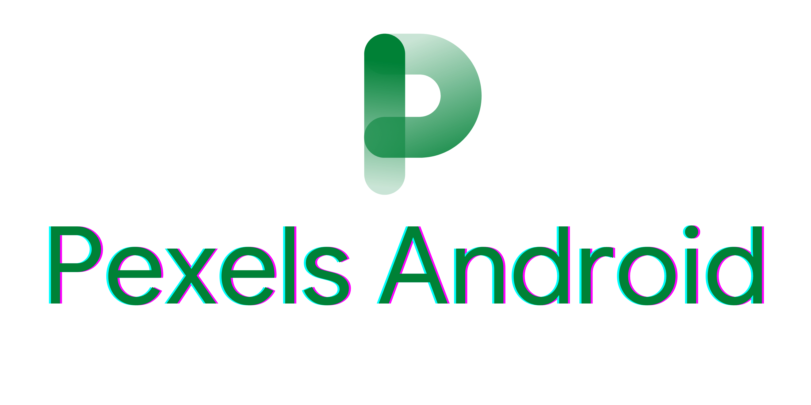

# Pexels Android Library

[](images/header.png)

Pexels Android Library is a wrapper library for Pexels REST API. It handles all the network transactions and provides the data. It uses the popular Android Network client [Retrofit](https://square.github.io/retrofit/).

This project started as a helper utils for my own projects. But then I decided to expand further to make it as a library.
There are many community libraries for other frameworks and languages, but a few for Android and JVM languages.

It uses Coroutines as its main weapon, but it also has support for Java devs too (by callback).

=== "Kotlin"

    ``` kotlin
    coroutineScope.launch {
        try {
            val response = pexelsClient.searchForPhotos("duck")
        } catch (e: Exception) {

        }
    }
    ```

=== "Java"

    ``` java
    pexelsClient.searchForPhotosCallback("duck") // (1)
        .setOnSuccessListener(response -> {

        })
        .setOnFailureListener(e -> {

        });
    ```

    1.  For every operation involves coroutines, suspend functions, there will be equivalent *Callback methods to support Java callers.


## Internal Dependencies
- [Pexels](https://www.pexels.com/)
- [Retrofit](https://square.github.io/retrofit/)

## Features
- List of Curated Photos
- Search Photos by query string
- List of Popular Videos
- Search Videos by query string

## Future
- Paging3 module

## License
```
Copyright 2022, Sanjay S

Licensed under the Apache License, Version 2.0 (the "License");
you may not use this work except in compliance with the License.
You may obtain a copy of the License in the LICENSE file, or at:

http://www.apache.org/licenses/LICENSE-2.0

Unless required by applicable law or agreed to in writing, software
distributed under the License is distributed on an "AS IS" BASIS,
WITHOUT WARRANTIES OR CONDITIONS OF ANY KIND, either express or implied.
See the License for the specific language governing permissions
and limitations under the License.
```